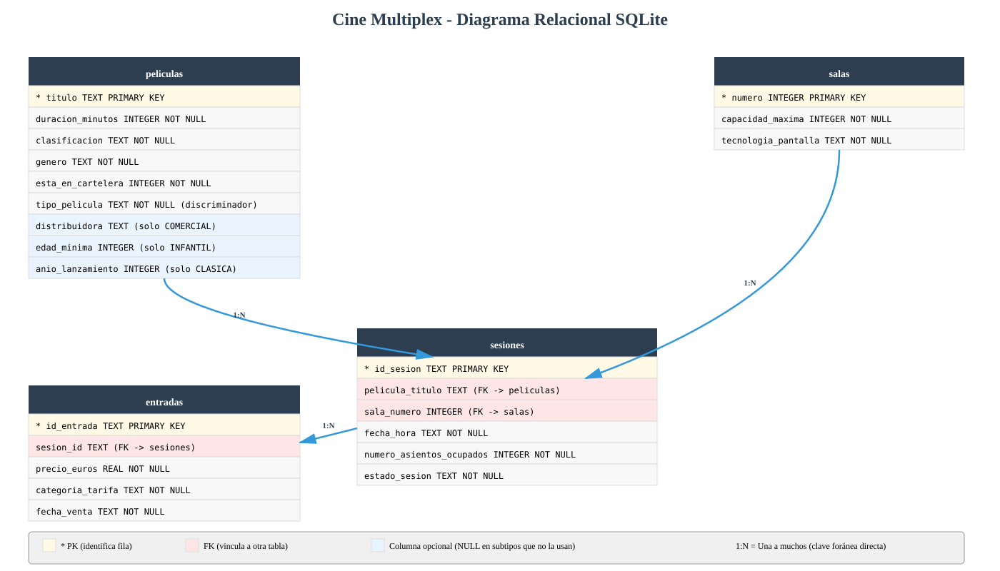

# Diseño de tablas SQLite para Sistema Cine Multiplex

Este documento te guía paso a paso para transformar tu proyecto de almacenamiento en memoria (diccionarios de Python) a una **base de datos SQLite persistente**. El objetivo es que entiendas qué tablas necesitas crear, por qué están diseñadas así y cómo escribir el SQL.

Como referencia, puedes consultar cómo se hizo esta misma transición en el proyecto modelo de la expendedora.


## Fase 1: Identificar las entidades y sus atributos

El primer paso es hacer un inventario de las clases de tu dominio que almacenan datos. Cada una de estas clases se convertirá en una **tabla** de la base de datos.

Vamos a repasar tus clases y qué atributos de cada una necesitamos guardar:

**Pelicula** (`domain/pelicula.py`) — Clase base

| Atributo | Tipo en Python | Tipo en SQL | Notas |
|---|---|---|---|
| `titulo` | str | TEXT | Clave natural del negocio (ej: "Dune: Parte Dos") |
| `duracion_minutos` | int | INTEGER | Duración en minutos |
| `clasificacion` | str | TEXT | Clasificación por edades (ej: PG-13, R) |
| `genero` | str | TEXT | Género (ej: Ciencia Ficción, Animación) |
| `esta_en_cartelera` | bool | INTEGER | 1 si está en cartelera, 0 si no |
| (discriminador) | — | TEXT | Columna `tipo_pelicula` para distinguir el subtipo: COMERCIAL, INFANTIL, CLASICA |
| `distribuidora` | str | TEXT | Solo para PeliculaComercial (NULL en otras) |
| `edad_minima` | int | INTEGER | Solo para PeliculaInfantil (NULL en otras) |
| `anio_lanzamiento` | int | INTEGER | Solo para PeliculaClasica (NULL en otras) |

**PeliculaComercial** — Hereda de Pelicula
- Añade el atributo `distribuidora`

**PeliculaInfantil** — Hereda de Pelicula
- Añade el atributo `edad_minima`

**PeliculaClasica** — Hereda de Pelicula
- Añade el atributo `anio_lanzamiento`

**Sala** (`domain/sala.py`)

| Atributo | Tipo en Python | Tipo en SQL | Notas |
|---|---|---|---|
| `numero` | int | INTEGER | Identificador único de la sala (ej: 1, 2, 3) |
| `capacidad_maxima` | int | INTEGER | Aforo total |
| `tecnologia_pantalla` | str | TEXT | Tipo de proyección: 2D, 3D, IMAX |

**Sesion** (`domain/sesion.py`)

| Atributo | Tipo en Python | Tipo en SQL | Notas |
|---|---|---|---|
| `id_sesion` | str | TEXT | Identificador único de la sesión |
| `pelicula` | Pelicula | TEXT (columna `pelicula_titulo`) | No guardamos el objeto completo: guardamos su título como FK a `peliculas(titulo)` |
| `sala` | Sala | INTEGER (columna `sala_numero`) | No guardamos el objeto completo: guardamos su número como FK a `salas(numero)` |
| `fecha_hora` | str | TEXT | Fecha y hora de la proyección (ej: "2026-04-20 18:00") |
| `numero_asientos_ocupados` | int | INTEGER | Asientos vendidos |
| `estado_sesion` | str | TEXT | programada, completa, cancelada |

**Entrada** (`domain/entrada.py`)

| Atributo | Tipo en Python | Tipo en SQL | Notas |
|---|---|---|---|
| `id_entrada` | str | TEXT | Identificador único (UUID de 8 caracteres) |
| `sesion` | Sesion | TEXT (columna `sesion_id`) | No guardamos el objeto completo: guardamos su `id_sesion` como FK a `sesiones(id_sesion)` |
| `precio_euros` | float | REAL | Precio pagado |
| `categoria_tarifa` | str | TEXT | Tipo de tarifa (ej: General, Reducida, Estudiante) |
| `fecha_venta` | datetime | TEXT | Timestamp ISO (ej: "2026-04-17T10:30:00") |


## Fase 2: Conceptos básicos de bases de datos

Antes de avanzar, necesitamos entender algunos conceptos:

### Tabla, fila y columna

Una **tabla** es como un diccionario de Python, pero guardado en disco:
- Cada **fila** es un objeto individual (una película, una sala, una sesión, una entrada)
- Cada **columna** es un atributo de ese objeto (el título, la capacidad, la fecha, etc.)

**Ejemplo:**
```
Tabla: peliculas
┌──────────────────────┬──────────┬──────────────┬─────────────────┐
│ titulo               │ duracion │ clasificacion│ genero          │
├──────────────────────┼──────────┼──────────────┼─────────────────┤
│ Dune: Parte Dos      │ 166      │ PG-13        │ Ciencia Ficción │
│ Kung Fu Panda 4      │ 94       │ PG           │ Animación       │
│ El Padrino           │ 175      │ R            │ Crimen          │
└──────────────────────┴──────────┴──────────────┴─────────────────┘
```

### Clave primaria (PRIMARY KEY)

Es la columna que **identifica de forma única cada fila**. No puede haber dos filas con el mismo valor en la clave primaria. En tu código:
- Para películas → `titulo` es la clave primaria
- Para salas → `numero` es la clave primaria
- Para sesiones → `id_sesion` es la clave primaria
- Para entradas → `id_entrada` es la clave primaria

### Clave foránea (FOREIGN KEY)

Es una columna que "apunta" a la clave primaria de **otra tabla**. Sirve para crear vínculos entre tablas y permite que la base de datos garantice que esos vínculos siempre sean válidos.

**Ejemplo:** Una sesión tiene un `sala_numero` que apunta a la clave primaria `numero` de la tabla `salas`. Si intentas guardar una sesión con una sala que no existe, la base de datos lo rechazará automáticamente.

En SQLite, para que se apliquen restricciones al usar las claves foráneas lo hacemos con `PRAGMA foreign_keys = ON` al inicio de cada conexión.

### Relaciones entre tablas

Una **relación** describe cómo se vinculan las filas de una tabla A con las filas de otra tabla B. Los tipos más comunes son:

- **Uno a uno (1:1):** Una fila de la tabla A se vincula con exactamente una fila de la tabla B. Raro en bases de datos.
  - Ejemplo: un empleado tiene un único correo corporativo; un correo corporativo pertenece a un único empleado.

- **Uno a muchos (1:N):** Una fila de la tabla A se vincula con múltiples filas de la tabla B. Muy común.
  - Ejemplo en tu proyecto: una **película** puede tener múltiples **sesiones**. La película "Dune: Parte Dos" puede proyectarse en las sesiones S001, S002 y S003.
  - Otro ejemplo: una **sala** puede albergar múltiples **sesiones**. La sala 1 puede tener sesiones por la mañana y por la noche.
  - Otro ejemplo: una **sesión** puede vender muchas **entradas** (una por cada espectador).

- **Muchos a muchos (N:M):** Una fila de la tabla A se vincula con múltiples filas de la tabla B, y viceversa. Requiere una tabla intermedia.
  - Ejemplo general: un **alumno** puede estar matriculado en muchos **cursos**, y un **curso** puede tener muchos **alumnos**.
  - En tu proyecto NO hay relaciones N:M directas (todas son 1:N).


## Fase 3: Identificar las relaciones entre entidades

Cuando un objeto **"pertenece a"** o **"contiene"** otro, eso se traduce en la base de datos mediante **claves foráneas** (FK).

### Relaciones uno a muchos (1:N)

**Una película se proyecta en muchas sesiones**
- Cada sesión proyecta exactamente una película
- Usamos la columna `pelicula_titulo` en la tabla `sesiones` como clave foránea que apunta a `peliculas(titulo)`

**Una sala alberga muchas sesiones**
- Cada sesión ocurre en exactamente una sala
- Usamos la columna `sala_numero` en la tabla `sesiones` como clave foránea que apunta a `salas(numero)`

**Una sesión vende muchas entradas**
- Cada entrada pertenece a exactamente una sesión
- Usamos la columna `sesion_id` en la tabla `entradas` como clave foránea que apunta a `sesiones(id_sesion)`

### Herencia en el dominio

En tu código, `PeliculaComercial`, `PeliculaInfantil` y `PeliculaClasica` heredan de `Pelicula`. En SQL, usamos:

**Tabla única con discriminador** (la opción elegida)
- Una sola tabla `peliculas` con columna `tipo_pelicula` ('COMERCIAL', 'INFANTIL', 'CLASICA')
- Los atributos específicos (`distribuidora`, `edad_minima`, `anio_lanzamiento`) se incluyen como columnas que aceptan NULL
- Más simple que dividir en varias tablas
- Evita uniones (joins) complicadas al recuperar una película


## Fase 4: Diseño de las tablas

### Tabla `peliculas` — Las películas del cine

Almacena todas las películas del sistema, ya sean comerciales, infantiles o clásicas.

| Columna | Tipo | Notas |
|---|---|---|
| `titulo` | TEXT | Clave primaria (ej: "Dune: Parte Dos") |
| `duracion_minutos` | INTEGER | Duración (NOT NULL) |
| `clasificacion` | TEXT | Clasificación por edades (NOT NULL) |
| `genero` | TEXT | Género (NOT NULL) |
| `esta_en_cartelera` | INTEGER | 1 si está en cartelera, 0 si no (NOT NULL) |
| `tipo_pelicula` | TEXT | Discriminador: 'COMERCIAL', 'INFANTIL' o 'CLASICA' (NOT NULL) |
| `distribuidora` | TEXT | Solo para PeliculaComercial (puede ser NULL) |
| `edad_minima` | INTEGER | Solo para PeliculaInfantil (puede ser NULL) |
| `anio_lanzamiento` | INTEGER | Solo para PeliculaClasica (puede ser NULL) |

**¿Por qué `tipo_pelicula` es necesario?** Aunque las tres subclases heredan de `Pelicula`, en SQL usamos una sola tabla. La columna `tipo_pelicula` indica qué tipo de película es, para poder reconstruir el objeto correcto cuando lo recuperes.

**¿Por qué los atributos específicos aceptan NULL?** Porque SQL exige que todas las filas tengan las mismas columnas. Una película comercial tiene `distribuidora` pero no `edad_minima` ni `anio_lanzamiento`; esas columnas estarán a NULL para ella.


### Tabla `salas` — Las salas de proyección

Almacena las salas del cine.

| Columna | Tipo | Notas |
|---|---|---|
| `numero` | INTEGER | Clave primaria (ej: 1, 2, 3) |
| `capacidad_maxima` | INTEGER | Aforo total (NOT NULL) |
| `tecnologia_pantalla` | TEXT | Tipo de pantalla: "2D", "3D", "IMAX" (NOT NULL) |

**¿Por qué `numero` como clave primaria?** En tu proyecto ya usas el número de sala como identificador natural (`_coleccion_salas[nueva_sala.numero]`). Mantenemos esa convención en la base de datos.


### Tabla `sesiones` — Las proyecciones programadas

Almacena las sesiones de cine (combinación de película, sala y horario).

| Columna | Tipo | Notas |
|---|---|---|
| `id_sesion` | TEXT | Clave primaria (identificador único de la sesión) |
| `pelicula_titulo` | TEXT | Clave foránea → `peliculas(titulo)` (NOT NULL) |
| `sala_numero` | INTEGER | Clave foránea → `salas(numero)` (NOT NULL) |
| `fecha_hora` | TEXT | Fecha y hora de la proyección (NOT NULL) |
| `numero_asientos_ocupados` | INTEGER | Asientos vendidos (NOT NULL, default 0) |
| `estado_sesion` | TEXT | Estado: "programada", "completa", "cancelada" (NOT NULL) |

**¿Por qué dos claves foráneas?** Porque una sesión enlaza una película concreta con una sala concreta. Ambas referencias deben existir en sus tablas respectivas.

**¿Por qué guardar `numero_asientos_ocupados` y no `numero_asientos_libres`?** Porque `libres = capacidad_maxima - ocupados` es un dato derivado que se puede calcular en el momento. Guardar solo el ocupado evita inconsistencias.


### Tabla `entradas` — Los tickets vendidos

Almacena el historial de entradas vendidas.

| Columna | Tipo | Notas |
|---|---|---|
| `id_entrada` | TEXT | Clave primaria (UUID de 8 caracteres) |
| `sesion_id` | TEXT | Clave foránea → `sesiones(id_sesion)` (NOT NULL) |
| `precio_euros` | REAL | Precio pagado (NOT NULL) |
| `categoria_tarifa` | TEXT | Tipo de tarifa: "General", "Reducida", etc. (NOT NULL) |
| `fecha_venta` | TEXT | Timestamp ISO de la venta (NOT NULL) |

**¿Por qué `fecha_venta` es TEXT?** SQLite almacena timestamps como strings en formato ISO 8601 (ej: "2026-04-17T10:30:00"). Es estándar y legible.

### Diagrama relacional resultante

Con el diseño de tablas descrito arriba, el esquema de la base de datos queda así:



El diagrama muestra las 4 tablas del sistema y sus relaciones:
- **peliculas → sesiones** (1:N): una película se proyecta en muchas sesiones
- **salas → sesiones** (1:N): una sala alberga muchas sesiones
- **sesiones → entradas** (1:N): una sesión vende muchas entradas


## Fase 5: SQL de creación

Aquí tienes el SQL completo para crear todas las tablas. **El orden importa:** las tablas que son referenciadas por otras (con claves foráneas) deben crearse primero.

```sql
PRAGMA foreign_keys = ON;

-- 1. Crear tabla de películas (no depende de ninguna otra tabla)
CREATE TABLE IF NOT EXISTS peliculas (
    titulo TEXT PRIMARY KEY,
    duracion_minutos INTEGER NOT NULL,
    clasificacion TEXT NOT NULL,
    genero TEXT NOT NULL,
    esta_en_cartelera INTEGER NOT NULL DEFAULT 1,
    tipo_pelicula TEXT NOT NULL,
    distribuidora TEXT,
    edad_minima INTEGER,
    anio_lanzamiento INTEGER
);

-- 2. Crear tabla de salas (no depende de ninguna otra tabla)
CREATE TABLE IF NOT EXISTS salas (
    numero INTEGER PRIMARY KEY,
    capacidad_maxima INTEGER NOT NULL,
    tecnologia_pantalla TEXT NOT NULL
);

-- 3. Crear tabla de sesiones (depende de peliculas y salas)
CREATE TABLE IF NOT EXISTS sesiones (
    id_sesion TEXT PRIMARY KEY,
    pelicula_titulo TEXT NOT NULL,
    sala_numero INTEGER NOT NULL,
    fecha_hora TEXT NOT NULL,
    numero_asientos_ocupados INTEGER NOT NULL DEFAULT 0,
    estado_sesion TEXT NOT NULL DEFAULT 'programada',
    FOREIGN KEY (pelicula_titulo) REFERENCES peliculas(titulo),
    FOREIGN KEY (sala_numero) REFERENCES salas(numero)
);

-- 4. Crear tabla de entradas (depende de sesiones)
CREATE TABLE IF NOT EXISTS entradas (
    id_entrada TEXT PRIMARY KEY,
    sesion_id TEXT NOT NULL,
    precio_euros REAL NOT NULL,
    categoria_tarifa TEXT NOT NULL,
    fecha_venta TEXT NOT NULL,
    FOREIGN KEY (sesion_id) REFERENCES sesiones(id_sesion)
);
```

**Explicación del orden:**
1. **peliculas** y **salas** se crean primero porque no tienen claves foráneas
2. **sesiones** se crea después porque necesita que peliculas y salas ya existan
3. **entradas** se crea al final porque necesita que sesiones ya exista


## Fase 6: Script de ejemplo para crear la base de datos

Este script Python crea la base de datos con todas las tablas e inserta datos iniciales de prueba (las mismas películas y salas que tienes ahora en `datos_iniciales.py`).

```python
"""Script para crear la base de datos de Cine Multiplex con datos iniciales."""

import sqlite3
from pathlib import Path

# Eliminar la base de datos si ya existe (para recrearla limpia)
ruta_bd = Path("cine.db")
if ruta_bd.exists():
    ruta_bd.unlink()

conn = sqlite3.connect("cine.db")
cursor = conn.cursor()
cursor.execute("PRAGMA foreign_keys = ON")

# Crear tablas (en el orden correcto: sin dependencias primero, luego con dependencias)
cursor.executescript("""
PRAGMA foreign_keys = ON;

CREATE TABLE IF NOT EXISTS peliculas (
    titulo TEXT PRIMARY KEY,
    duracion_minutos INTEGER NOT NULL,
    clasificacion TEXT NOT NULL,
    genero TEXT NOT NULL,
    esta_en_cartelera INTEGER NOT NULL DEFAULT 1,
    tipo_pelicula TEXT NOT NULL,
    distribuidora TEXT,
    edad_minima INTEGER,
    anio_lanzamiento INTEGER
);

CREATE TABLE IF NOT EXISTS salas (
    numero INTEGER PRIMARY KEY,
    capacidad_maxima INTEGER NOT NULL,
    tecnologia_pantalla TEXT NOT NULL
);

CREATE TABLE IF NOT EXISTS sesiones (
    id_sesion TEXT PRIMARY KEY,
    pelicula_titulo TEXT NOT NULL,
    sala_numero INTEGER NOT NULL,
    fecha_hora TEXT NOT NULL,
    numero_asientos_ocupados INTEGER NOT NULL DEFAULT 0,
    estado_sesion TEXT NOT NULL DEFAULT 'programada',
    FOREIGN KEY (pelicula_titulo) REFERENCES peliculas(titulo),
    FOREIGN KEY (sala_numero) REFERENCES salas(numero)
);

CREATE TABLE IF NOT EXISTS entradas (
    id_entrada TEXT PRIMARY KEY,
    sesion_id TEXT NOT NULL,
    precio_euros REAL NOT NULL,
    categoria_tarifa TEXT NOT NULL,
    fecha_venta TEXT NOT NULL,
    FOREIGN KEY (sesion_id) REFERENCES sesiones(id_sesion)
);
""")

# Insertar datos iniciales

# 1. Crear películas (una de cada subtipo, igual que en datos_iniciales.py)
cursor.execute("""
    INSERT INTO peliculas
    (titulo, duracion_minutos, clasificacion, genero, esta_en_cartelera,
     tipo_pelicula, distribuidora, edad_minima, anio_lanzamiento)
    VALUES ('Dune: Parte Dos', 166, 'PG-13', 'Ciencia Ficción', 1,
            'COMERCIAL', 'Warner Bros', NULL, NULL)
""")

cursor.execute("""
    INSERT INTO peliculas
    (titulo, duracion_minutos, clasificacion, genero, esta_en_cartelera,
     tipo_pelicula, distribuidora, edad_minima, anio_lanzamiento)
    VALUES ('Kung Fu Panda 4', 94, 'PG', 'Animación', 1,
            'INFANTIL', NULL, 5, NULL)
""")

cursor.execute("""
    INSERT INTO peliculas
    (titulo, duracion_minutos, clasificacion, genero, esta_en_cartelera,
     tipo_pelicula, distribuidora, edad_minima, anio_lanzamiento)
    VALUES ('El Padrino', 175, 'R', 'Crimen', 1,
            'CLASICA', NULL, NULL, 1972)
""")

# 2. Crear salas
cursor.execute("INSERT INTO salas (numero, capacidad_maxima, tecnologia_pantalla) VALUES (1, 100, '2D')")
cursor.execute("INSERT INTO salas (numero, capacidad_maxima, tecnologia_pantalla) VALUES (2, 50, '3D')")
cursor.execute("INSERT INTO salas (numero, capacidad_maxima, tecnologia_pantalla) VALUES (3, 30, 'IMAX')")

# 3. Crear una sesión de ejemplo
cursor.execute("""
    INSERT INTO sesiones (id_sesion, pelicula_titulo, sala_numero, fecha_hora,
                          numero_asientos_ocupados, estado_sesion)
    VALUES ('S001', 'Dune: Parte Dos', 1, '2026-04-20 18:00', 0, 'programada')
""")

conn.commit()
conn.close()

print("Base de datos creada en: cine.db")
```

**Características importantes:**
- Elimina la BD existente para recrearla limpia.
- Crea las tablas en el orden correcto
- Inserta datos de ejemplo que puedes usar para probar
- Activa integridad referencial con `PRAGMA foreign_keys = ON`


## Fase 7: Ejemplo de implementación del repositorio SQLite

Aquí tienes un ejemplo de cómo implementaría uno de tus repositorios usando SQLite en lugar de diccionarios en memoria.

**Importante:** Este ejemplo asume que ya has creado las **excepciones de dominio** en `infrastructure/errores.py` (ver "Excepciones de dominio para persistencia" en la checklist de la Fase 04). Si aún no las has creado, debes hacerlo primero. Las excepciones necesarias son:

```python
class ErrorRepositorio(Exception):
    """Clase base para todas las excepciones del repositorio."""
    pass

class PeliculaYaExisteError(ErrorRepositorio):
    """Se lanza cuando se intenta guardar una película con título duplicado."""
    pass

class PeliculaNoEncontradaError(ErrorRepositorio):
    """Se lanza cuando se intenta recuperar una película inexistente."""
    pass

class SalaYaExisteError(ErrorRepositorio):
    """Se lanza cuando se intenta guardar una sala con número duplicado."""
    pass

class SalaNoEncontradaError(ErrorRepositorio):
    """Se lanza cuando se intenta recuperar una sala inexistente."""
    pass

class SesionYaExisteError(ErrorRepositorio):
    """Se lanza cuando se intenta guardar una sesión con id duplicado."""
    pass

class SesionNoEncontradaError(ErrorRepositorio):
    """Se lanza cuando se intenta recuperar una sesión inexistente."""
    pass

class ErrorPersistencia(ErrorRepositorio):
    """Se lanza para errores inesperados de la base de datos."""
    pass
```

**Ejemplo para `RepositorioSQLite` — Método `guardar_pelicula()`:**

Tu interfaz `RepositorioCine` expone métodos como `guardar_pelicula`, `obtener_pelicula_por_titulo`, `guardar_sala`, etc. La implementación SQLite debe respetar esos nombres y firmas.

```python
import sqlite3
from cine_multiplex.infrastructure.errores import (
    PeliculaYaExisteError,
    ErrorPersistencia,
)
from cine_multiplex.domain.pelicula import (
    PeliculaComercial,
    PeliculaInfantil,
    PeliculaClasica,
)


class RepositorioSQLite:
    def __init__(self, ruta_bd="cine.db"):
        self._ruta_bd = ruta_bd

    def guardar_pelicula(self, nueva_pelicula):
        """Persiste una película en la base de datos."""
        conn = sqlite3.connect(self._ruta_bd)
        try:
            with conn:
                cursor = conn.cursor()
                cursor.execute("PRAGMA foreign_keys = ON")

                # Determinar el subtipo y los atributos específicos
                if isinstance(nueva_pelicula, PeliculaComercial):
                    tipo = "COMERCIAL"
                    distribuidora = nueva_pelicula.distribuidora
                    edad_minima = None
                    anio = None
                elif isinstance(nueva_pelicula, PeliculaInfantil):
                    tipo = "INFANTIL"
                    distribuidora = None
                    edad_minima = nueva_pelicula.edad_minima
                    anio = None
                elif isinstance(nueva_pelicula, PeliculaClasica):
                    tipo = "CLASICA"
                    distribuidora = None
                    edad_minima = None
                    anio = nueva_pelicula.anio_lanzamiento
                else:
                    raise ValueError(f"Tipo de película desconocido: {type(nueva_pelicula).__name__}")

                cursor.execute(
                    """INSERT INTO peliculas
                       (titulo, duracion_minutos, clasificacion, genero, esta_en_cartelera,
                        tipo_pelicula, distribuidora, edad_minima, anio_lanzamiento)
                       VALUES (?, ?, ?, ?, ?, ?, ?, ?, ?)""",
                    (nueva_pelicula.titulo,
                     nueva_pelicula.duracion_minutos,
                     nueva_pelicula.clasificacion,
                     nueva_pelicula.genero,
                     1 if nueva_pelicula.esta_en_cartelera else 0,
                     tipo,
                     distribuidora,
                     edad_minima,
                     anio),
                )
        except sqlite3.IntegrityError as e:
            # IntegrityError → violación de PRIMARY KEY (título duplicado)
            raise PeliculaYaExisteError(
                f"Ya existe una película con título '{nueva_pelicula.titulo}'"
            ) from e
        except sqlite3.OperationalError as e:
            # OperationalError → problema técnico (conexión, sintaxis, permisos)
            raise ErrorPersistencia(f"Error al guardar la película: {e}") from e
        finally:
            conn.close()
```

**Explicación:**
1. Abre conexión a la BD y activa integridad referencial.
2. Usa `isinstance()` para detectar el subtipo de película y extraer los atributos específicos (`distribuidora`, `edad_minima` o `anio_lanzamiento`).
3. Inserta con consulta parametrizada (`?`) para prevenir inyección SQL.
4. Transforma `IntegrityError` en `PeliculaYaExisteError` y `OperationalError` en `ErrorPersistencia`.

**Ejemplo para `RepositorioSQLite` — Método `obtener_pelicula_por_titulo()`:**

**Nota sobre el contrato actual:** Tu `RepositorioMemoria.obtener_pelicula_por_titulo()` devuelve `None` si la película no existe (no lanza excepción), y tu `ServicioCine` lo usa como `if obtener_pelicula_por_titulo(titulo): ...`. Para mantener compatibilidad con ese contrato, el ejemplo siguiente también devuelve `None` cuando no encuentra la película. Si prefieres cambiar a excepciones de dominio (`PeliculaNoEncontradaError`), deberás actualizar también el servicio que usa el método.

```python
import sqlite3
from cine_multiplex.infrastructure.errores import ErrorPersistencia
from cine_multiplex.domain.pelicula import (
    PeliculaComercial,
    PeliculaInfantil,
    PeliculaClasica,
)


    def obtener_pelicula_por_titulo(self, nombre_pelicula):
        """Busca una película por su título. Devuelve None si no existe."""
        conn = sqlite3.connect(self._ruta_bd)
        try:
            cursor = conn.cursor()
            cursor.execute("PRAGMA foreign_keys = ON")
            cursor.execute(
                """SELECT titulo, duracion_minutos, clasificacion, genero,
                          esta_en_cartelera, tipo_pelicula, distribuidora,
                          edad_minima, anio_lanzamiento
                   FROM peliculas WHERE titulo = ?""",
                (nombre_pelicula,),
            )
            fila = cursor.fetchone()
            if fila is None:
                return None  # Respeta el contrato actual de RepositorioMemoria
            return self._fila_a_pelicula(fila)
        except sqlite3.OperationalError as e:
            raise ErrorPersistencia(f"Error al obtener la película: {e}") from e
        finally:
            conn.close()

    def _fila_a_pelicula(self, fila):
        """Convierte una fila de la BD en un objeto Pelicula del tipo correcto."""
        (titulo, duracion, clasificacion, genero, en_cartelera,
         tipo, distribuidora, edad_minima, anio) = fila

        if tipo == "COMERCIAL":
            pelicula = PeliculaComercial(titulo, duracion, clasificacion, genero, distribuidora)
        elif tipo == "INFANTIL":
            pelicula = PeliculaInfantil(titulo, duracion, clasificacion, genero, edad_minima)
        elif tipo == "CLASICA":
            pelicula = PeliculaClasica(titulo, duracion, clasificacion, genero, anio)
        else:
            raise ErrorPersistencia(f"Tipo de película desconocido en BD: {tipo}")

        # Restaurar el estado de cartelera (el constructor lo inicializa a True)
        pelicula.esta_en_cartelera = bool(en_cartelera)
        return pelicula
```

**Puntos clave de ambos métodos:**
- Siempre activa `PRAGMA foreign_keys = ON` para garantizar integridad referencial.
- Usa parámetros `?` en lugar de concatenar strings (previene inyección SQL).
- Transforma excepciones técnicas de SQLite en excepciones de dominio (para `IntegrityError` y `OperationalError`), pero respeta el contrato actual del método (devolver `None` cuando la película no existe) para no romper el servicio que lo usa.
- Usa `tipo_pelicula` como discriminador para reconstruir el objeto correcto (`PeliculaComercial`, `PeliculaInfantil` o `PeliculaClasica`).
- Después de construir la película, restaura `esta_en_cartelera` asignándola a través del setter (el constructor siempre la pone a `True`).


## Resumen: de memoria a SQLite

### Mapeado de conceptos

| Código Python (fase actual, en memoria) | Base de datos SQLite (fase 04) | Propósito |
|---|---|---|
| `_coleccion_peliculas = {}` | Tabla `peliculas` (con columna `tipo_pelicula`) | Guardar todas las películas persistentemente |
| `_coleccion_salas = {}` | Tabla `salas` | Guardar todas las salas persistentemente |
| `_coleccion_sesiones = {}` | Tabla `sesiones` | Guardar todas las sesiones persistentemente |
| `_coleccion_entradas = []` | Tabla `entradas` | Guardar el historial de ventas persistentemente |

### Beneficios de migrar a SQLite

- **Persistencia:** Los datos no desaparecen al cerrar el programa
- **Integridad referencial:** Las claves foráneas garantizan que no habrá datos rotos (ej: una sesión con una sala que no existe)
- **Escalabilidad:** Manejo eficiente de grandes volúmenes de datos
- **Estándar:** SQL es un estándar conocido y usado en la industria
- **Simple:** SQLite no necesita un servidor externo, es un fichero `cine.db`

### Arquitectura en capas (sin cambios en lógica)

```
┌─────────────────────────────────────┐
│  Presentation (menú)                │
│  - No toca datos                    │
└──────────────┬──────────────────────┘
               │ usa
┌──────────────▼──────────────────────┐
│  Application (servicios)            │
│  - ServicioCine                     │
│  - Usa el repositorio               │
└──────────────┬──────────────────────┘
               │ usa
┌──────────────▼──────────────────────┐
│  Domain (entidades + contratos)     │
│  - Pelicula, Sala, Sesion, Entrada  │
│  - RepositorioCine (contrato)       │
└──────────────┬──────────────────────┘
               │ implementado por
┌──────────────▼──────────────────────┐
│  Infrastructure (implementación)    │
│  - RepositorioSQLite                │
│  - Lee/escribe en tablas            │
└─────────────────────────────────────┘
```

**Lo importante:** Domain y Application no cambian. Solo Infrastructure.


## Estado de la Checklist Fase 04

Marcamos con [x] los apartados que **este documento cubre o sirve de referencia** y con [ ] los que son **responsabilidad tuya** dentro de tu proyecto. Para los apartados pendientes puedes consultar cómo se hicieron en el proyecto modelo de la expendedora (`modelo/cepy_pd4/proyecto/04-sqlite/expendedora/`).

### Diseño e implementación del esquema de base de datos

- [x] Copiar en `04-sqlite` el estado base de `03-testing` (o crear rama específica para la fase 04) — *Hecho: carpeta `04-sqlite/` creada a partir de `03-testing`*
- [x] Diseñar las tablas SQL mapeando cada entidad de dominio a tablas con sus columnas, tipos y restricciones (`PRIMARY KEY`, `NOT NULL`, `FOREIGN KEY`) — **Fases 1-4 de este documento**
- [x] Usar nombres de columnas en snake_case — **Fase 4 de este documento**

### Script de inicialización de base de datos

- [ ] Crear script que cree el esquema de la BD e inserte datos iniciales de prueba — **Fase 6 de este documento**
  - [ ] Debe poder ejecutarse varias veces sin error — **Fase 6**
  - [ ] Crea todas las tablas respetando dependencias de claves foráneas — **Fases 5-6**
  - [ ] Inserta datos iniciales para probar la aplicación — **Fase 6**

### Excepciones de dominio para persistencia

- [ ] (*opcional*) Crear fichero de excepciones (`infrastructure/errores.py`) con las excepciones que el repositorio SQLite lanza al usuario — **Fase 7 de este documento (código de ejemplo)**
  - [ ] Clase base para todas las excepciones de persistencia — **Fase 7**
  - [ ] Excepciones por cada tipo de error que puede ocurrir (duplicado, no encontrado, etc.) — **Fase 7**

### Implementación del repositorio SQLite

- [ ] Crear clase(s) de repositorio que implementen persistencia en SQLite (realizando las mismas operaciones que el repositorio en memoria: guardar, obtener, actualizar, eliminar, etc.) — **Fase 7 de este documento (código de ejemplo)**
- [ ] Usar consultas SQL parametrizadas (parámetros `?`) para prevenir inyección SQL — **Fase 7**
- [ ] Capturar excepciones SQLite (`sqlite3.IntegrityError`, `sqlite3.OperationalError`, etc.) y transformarlas en excepciones de dominio — **Fase 7**
- [ ] Activar `PRAGMA foreign_keys = ON` al conectar para garantizar integridad referencial — **Fase 7**
- [ ] **El flujo principal de la aplicación (menú) debe usar SOLO el repositorio SQLite para persistencia** (no usar en memoria) — *Responsabilidad tuya*

### Repositorio en memoria (referencia, no en uso)

- [ ] (**opcional**) Mantener el código del repositorio en memoria como referencia de implementación y contrato — *Responsabilidad tuya*
- [ ] (**opcional**) Modificar `infrastructure/repositorio_memoria.py` para lanzar las **mismas excepciones de dominio** que el repositorio SQLite (útil para tests sin persistencia) — *Responsabilidad tuya*

### Integración con SQLite en la capa de presentación

- [ ] Modificar la capa de presentación para cargar datos iniciales desde la BD en lugar de desde memoria (al iniciar la aplicación) — *Responsabilidad tuya*
- [ ] Capturar excepciones de dominio, no excepciones de `sqlite3` — *Responsabilidad tuya*
- [ ] (*opcional*) Mostrar mensajes amigables al usuario cuando ocurran errores de persistencia — *Responsabilidad tuya*
- [ ] No hacer imports de `sqlite3` directamente en la presentación — *Responsabilidad tuya*

### Actualización de los tests

- [ ] *(opcional)* Actualizar tests existentes para esperar excepciones de dominio en lugar de excepciones genéricas de Python — *Responsabilidad tuya*
- [ ] Verificar que `python -m unittest` pasa con todos los tests en verde — *Responsabilidad tuya*
- [ ] *(opcional)* Crear tests específicos para el repositorio SQLite — *Responsabilidad tuya*

### Documentación

- [ ] Actualizar `CHANGELOG.md` (versión `0.4.0`) con los cambios principales — *Responsabilidad tuya*
- [ ] Actualizar `README.md` con instrucciones de cómo ejecutar el script de inicialización — *Responsabilidad tuya*
- [ ] Documentar el diseño de la BD en `docs/DISEÑO_BD.md` (opcional) — *Este documento es base para completarlo*
- [ ] (*opcional*) Documentar el contrato de excepciones en `docs/CONTRATO_EXCEPCIONES.md` — *Responsabilidad tuya*

### Verificación final

- [ ] La aplicación funciona igual desde el punto de vista del usuario (mismo menú, mismas operaciones) — *Responsabilidad tuya*
- [ ] Los datos persisten entre ejecuciones (cierra y reabre la app, verifica que los datos están) — *Responsabilidad tuya*
- [ ] Los tests pasan todos sin cambios de lógica de dominio — *Responsabilidad tuya*


## Próximos pasos

1. Lee este documento con atención, especialmente las Fases 2-4.
2. Crea la base de datos ejecutando el script de la Fase 6 (`crear_bd.py`).
3. Crea el fichero de excepciones de dominio `infrastructure/errores.py` siguiendo el ejemplo de la Fase 7.
4. Implementa `infrastructure/repositorio_sqlite.py` respetando la interfaz `RepositorioCine` (usa el código de Fase 7 como referencia y el proyecto de la expendedora como ejemplo completo).
5. Modifica `infrastructure/datos_iniciales.py` (o el punto de entrada que use el menú) para instanciar `RepositorioSQLite` en lugar de `RepositorioMemoria`.
6. Asegúrate de que la capa de presentación captura excepciones de dominio (no de `sqlite3`) y no importa `sqlite3` directamente.
7. Actualiza los tests para esperar excepciones de dominio; añade tests específicos del repositorio SQLite si te es útil.
8. Completa la documentación: `docs/DISEÑO_BD.md`, `docs/CONTRATO_EXCEPCIONES.md` (opcional), `CHANGELOG.md` (versión `0.4.0`) y `README.md` con instrucciones de `crear_bd.py`.
